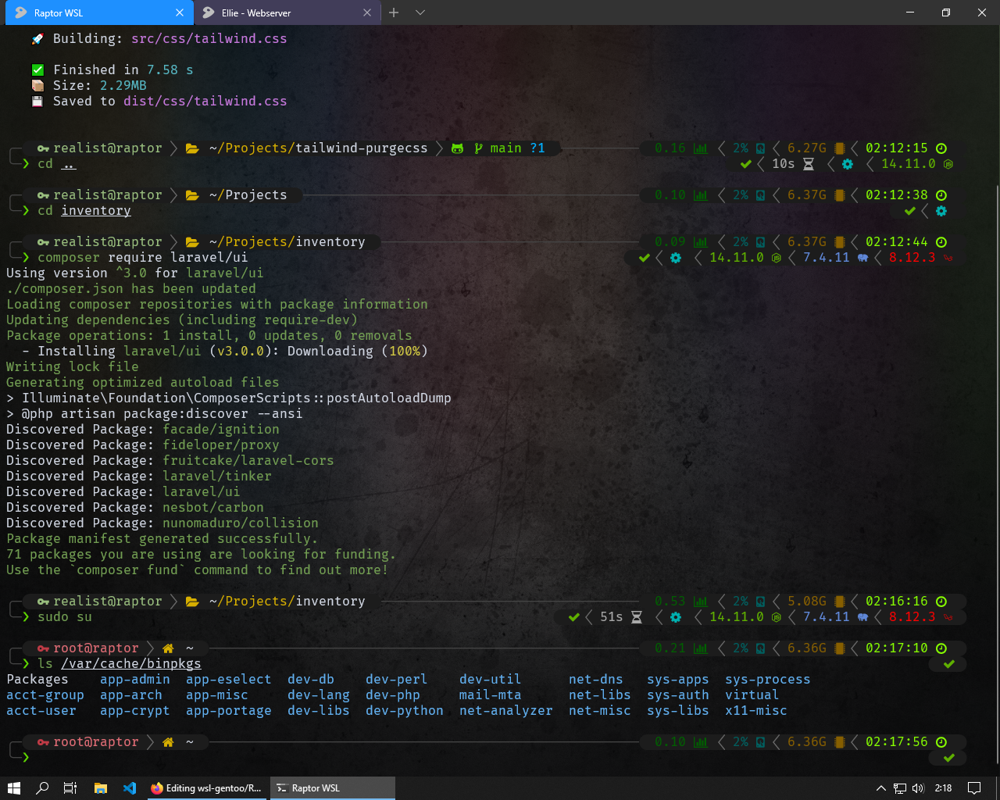

# Web develop Gentoo for WSL by Lotrando

Installation tutorial, how install Gentoo Linux for Webdevelopers with oh-my-zsh and Powerlevel10k theme on Windows.

... with my configuration files, your terminal might look like this 👇

<h1 align="center">
  
</h1>

### Step 1. Enable WSL and Virtual machines on your Windows

1. Run powershell.exe on windows 10 as Administrator.

2. Enable Microsoft-Windows-Subsystem-Linux components for WSL 1.

```
  dism /online /enable-feature /featurename:Microsoft-Windows-Subsystem-Linux /all /norestart
```

3. Enable Hyper-V for WSL 2 (Additional requirement for WSL 2 support).

```
  dism /online /enable-feature /featurename:VirtualMachinePlatform /all /norestart
```

4. Download [WSL 2 kernel update](https://wslstorestorage.blob.core.windows.net/wslblob/wsl_update_x64.msi) , install it and reboot your Windows 10.

---

### Step 2. Create Gentoo WSL Machine

1. Install [Windows Terminal](https://www.microsoft.com/cs-cz/p/windows-terminal/9n0dx20hk701?activetab=pivot:overviewtab) from Microsoft store.

2. Run again powershell.exe as Administrator and set working directory to `C:\Users\YOURUSERNAME\Downloads\`

3. Download actual stage 3 from [here](https://mirror.bytemark.co.uk/gentoo//releases/amd64/autobuilds/current-stage3-amd64/),
   or download stage from [this link](https://mirror.bytemark.co.uk/gentoo//releases/amd64/autobuilds/current-stage3-amd64/stage3-amd64-nomultilib-20201028T214503Z.tar.xz) to `C:\Users\YOURUSERNAME\Downloads\`.

4. Extract file to simple .tar with 7Zip. Destination file must have .tar file extension and his location must be
`C:\Users\YOURUSERNAME\Downloads\stage3-amd64-nomultilib-20201028T214503Z.tar`.

5. Create WSL 2 machine with name "Gentoo" in directory "C:\Gentoo" from "stage3-amd64-nomultilib-20201028T214503Z.tar".

```
  wsl --import "Gentoo" "C:\Gentoo" "stage3-amd64-nomultilib-20201028T214503Z.tar" --version 2
```

6. Set Gentoo to default distro

```
  wsl --setdefault Gentoo
```
7. Download my favourite patched nerd font [<strong>Fira Code Regular Nerd Font Complete Windows Compatible</strong>](https://github.com/lotrando/wsl-gentoo/raw/main/fonts/FiraCode%20NF/Fira%20Code%20Regular%20Nerd%20Font%20Complete%20Windows%20Compatible.ttf) install it.

8. Download [<strong>Gentoo icon</strong>](https://github.com/lotrando/wsl-gentoo/raw/main/configs/gentoo-icon.png) and [<strong>backgroud</strong>](https://github.com/lotrando/wsl-gentoo/raw/main/configs/zsh.jpg) for Windows Terminal and copy it to C:\Gentoo 
---

### Step 3. Config Windows Terminal, update portage, install packages and create user

1. Run Windows Terminal, open setting and copy&paste [my Windows Terminal settings](https://github.com/lotrando/wsl-gentoo/blob/main/configs/settings.json). Only your Gentoo magine not edit.

2. In Windows Terminal run Gentoo distro ( default is root ) and run

```
 mkdir /var/db/repo/gentoo && emerge-webrsync
```

3. Create classic user and set password.

```
useradd -m -G audio,video,usb,cdrom,portage,users,wheel -s /bin/bash your_account_name
passwd your_account_name
```

4. Set locales (in my case czech language) and set-up daemons.

* Change file

```
nano etc/locale.gen
```

```
cs_CZ ISO-8859-2
cs_CZ.UTF-8 UTF-8
```

* and file

```
nano /etc/env.d/02locale`
```

```
LANG="cs_CZ.UTF-8"
LC_COLLATE="C"
```

* run a few commands

```
locale-gen
echo "Europe/Prague" > /etc/timezone
emerge --config sys-libs/timezone-data
eselect locale list
eselect locale set (number of selected locale)
source /etc/profile
```

4. Set few system daemons

```
rc-update add cronie default
rc-update add syslog-ng default
rc-update add gpm default
rc-update add numlock default
```

5. Configure `sudo`, in `/etc/sudoers`.

* uncomment next line to allow members of group `wheel` to execute any command as root.

```
%wheel ALL=(ALL) ALL
```

* or same thing without password

```
%wheel ALL=(ALL) NOPASSWD: ALL
```

---

### Step 4. Edit .reg file for switch Windows Terminal to run as user default

1. Run regedit.exe in windows and find

`HKEY_CURRENT_USER\SOFTWARE\Microsoft\Windows\CurrentVersion\Lxss\....`

2. chose your Gentoo ID and change item

`"DefaultUid"=dword:00000000 -> "DefaultUid"=dword:000003e8`

(000003e8 is ID of first created user - 1000 in HEX)

like this ...

```
Windows Registry Editor Version 5.00

[HKEY_CURRENT_USER\SOFTWARE\Microsoft\Windows\CurrentVersion\Lxss\{your_gentoo_wsl_id}]
"State"=dword:00000001
"DistributionName"="Gentoo"
"Version"=dword:00000002
"BasePath"="\\\\?\\C:\\Gentoo"
"Flags"=dword:0000000f
"DefaultUid"=dword:000003e8
```

---

### Step 5. Install Gentoo web developing packages and oh-my-zsh with beautiful powerlevel10k theme

1. Remove package.use directory

```
rm -R /etc/portage/package.use
```

and replace this directory with file

```
nano /etc/portage/package.use
```

content of `package.use`

```
# MC
app-misc/mc sftp gpm

# PHP
dev-lang/php bcmath calendar curl mysql mysqli pdo postgres snmp soap sockets sodium sqlite threads xmlreader xmlwriter zip

# SQLITE
dev-db/sqlite secure-delete
```

2. create file /etc/portage/package.accept_keywords

```
nano /etc/portage/package.accept_keywords
```

content of `package.accept_keywords`

```
# COMPOSER
dev-php/composer ~amd64
dev-php/ca-bundle ~amd64
dev-php/psr-log ~amd64
dev-php/json-schema ~amd64
dev-php/jsonlint ~amd64
dev-php/phar-utils ~amd64
dev-php/semver ~amd64
dev-php/spdx-licenses ~amd64
dev-php/symfony-console ~amd64
dev-php/symfony-filesystem ~amd64
dev-php/symfony-finder ~amd64
dev-php/symfony-process ~amd64
dev-php/xdebug-handler ~amd64
dev-php/symfony-event-dispatcher ~amd64
dev-php/symfony-dependency-injection ~amd64
dev-php/symfony-config ~amd64
net-libs/nghttp2 ~amd64

# ZSH
app-shells/oh-my-zsh ~amd64
```

3. edit file `/etc/portage/make.conf`

```
nano /etc/portage/make.conf
```

content of `make.conf`

```
NCORES="4"

CFLAGS="-O2 -pipe"
CFLAGS="${CFLAGS}"
CXXFLAGS="${CFLAGS}"
FCFLAGS="${CFLAGS}"
FFLAGS="${CFLAGS}"
LDFLAGS="${LDFLAGS}"
MAKEOPTS="-j$NCORES"
CPU_FLAGS_X86="aes avx f16c fma3 fma4 mmx mmxext pclmul popcnt sse sse2 sse3 sse4_1 sse4_2 sse4a ssse3 xop"
CMAKE_MAKEFILE_GENERATOR=ninja

GENTOO_MIRRORS="https://mirror.dkm.cz/gentoo/"
PORTAGE_SYNC_STALE="30"
PORTDIR="/var/db/repos/gentoo"
DISTDIR="/var/cache/distfiles"
PKGDIR="/var/cache/binpkgs"
PORTAGE_TMPDIR="/var/tmp"
ACCEPT_LICENSE="-* @FREE"
CLEAN_DELAY="10"
EMERGE_WARNING_DELAY="10"
EMERGE_DEFAULT_OPTS="-av --complete-graph"
FEATURES="-ipc-sandbox -pid-sandbox -mount-sandbox -network-sandbox"
CONFIG_PROTECT="/etc"
CONFIG_PROTECT_MASK="/etc/env.d"
AUTOCLEAN="yes"
PORTAGE_NICENESS=15

LC_MESSAGES=C
LINGUAS="cs"
L10N="cs"

USE="-X -gtk -gnome -kde -perl -qt5 nls"

PYTHON_TARGETS="python2_7 python3_7"
PYTHON_SINGLE_TARGET="python3_7"

PHP_TARGETS="php7-4"
```

4. Install necessary system libs and packages for webdevelopers.

```
emerge cronie syslog-ng gpm app-misc/mc genlop gentoolkit lsof htop sudo composer nodejs
```

5. Now we can regulary install `zsh` and masked `oh-my-zsh`by ~amd64 with usefull `gentoo-zsh-completition` and `zsh-completions`. 😄

```
emerge zsh oh-my-zsh gentoo-zsh-completions zsh-completions
```

6. Set path for plugins and theme instlallation

```
export ZSH="/usr/share/zsh/site-contrib/oh-my-zsh"
export ZSH_CUSTOM="$ZSH/custom"
```

7. Install powerlevel10k theme with config wizad and 2 usefull zsh plugins autosuggestions and syntax-highlighting as root for all users.

```
  git clone https://github.com/romkatv/powerlevel10k.git $ZSH_CUSTOM/themes/powerlevel10k
  git clone https://github.com/zsh-users/zsh-autosuggestions.git $ZSH_CUSTOM/plugins/zsh-autosuggestions
  git clone https://github.com/zsh-users/zsh-syntax-highlighting.git $ZSH_CUSTOM/plugins/zsh-syntax-highlighting
```

8. Create ~/.zshrc and /root/.zshrc

```
  nano ~/.zshrc
  nano /root/.zshrc
```

Insert theese lines into both config files. For root user don't must have *laravel composer npm npx* in plugins and alias for Visual Studio Code 👍.

```
# Enable Powerlevel10k instant prompt. Should stay close to the top of ~/.zshrc.
# Initialization code that may require console input (password prompts, [y/n]
# confirmations, etc.) must go above this block; everything else may go below.
if [[ -r "${XDG_CACHE_HOME:-$HOME/.cache}/p10k-instant-prompt-${(%):-%n}.zsh" ]]; then
  source "${XDG_CACHE_HOME:-$HOME/.cache}/p10k-instant-prompt-${(%):-%n}.zsh"
fi

# If you come from bash you might have to change your $PATH.
# export PATH=$HOME/bin:/usr/local/bin:$PATH

# Path to your oh-my-zsh installation.
export ZSH="/usr/share/zsh/site-contrib/oh-my-zsh"

# Set name of the theme to load --- if set to "random", it will
# load a random theme each time oh-my-zsh is loaded, in which case,
# to know which specific one was loaded, run: echo $RANDOM_THEME
# See https://github.com/ohmyzsh/ohmyzsh/wiki/Themes
ZSH_THEME="powerlevel10k/powerlevel10k"

# Set list of themes to pick from when loading at random
# Setting this variable when ZSH_THEME=random will cause zsh to load
# a theme from this variable instead of looking in $ZSH/themes/
# If set to an empty array, this variable will have no effect.
# ZSH_THEME_RANDOM_CANDIDATES=( "robbyrussell" "agnoster" )

# Uncomment the following line to use case-sensitive completion.
# CASE_SENSITIVE="true"

# Uncomment the following line to use hyphen-insensitive completion.
# Case-sensitive completion must be off. _ and - will be interchangeable.
# HYPHEN_INSENSITIVE="true"

# Uncomment the following line to disable bi-weekly auto-update checks.
# DISABLE_AUTO_UPDATE="true"

# Uncomment the following line to automatically update without prompting.
# DISABLE_UPDATE_PROMPT="true"

# Uncomment the following line to change how often to auto-update (in days).
# export UPDATE_ZSH_DAYS=13

# Uncomment the following line if pasting URLs and other text is messed up.
# DISABLE_MAGIC_FUNCTIONS="true"

# Uncomment the following line to disable colors in ls.
# DISABLE_LS_COLORS="true"

# Uncomment the following line to disable auto-setting terminal title.
# DISABLE_AUTO_TITLE="true"

# Uncomment the following line to enable command auto-correction.
ENABLE_CORRECTION="true"

# Uncomment the following line to display red dots whilst waiting for completion.
COMPLETION_WAITING_DOTS="true"

# Uncomment the following line if you want to disable marking untracked files
# under VCS as dirty. This makes repository status check for large repositories
# much, much faster.
# DISABLE_UNTRACKED_FILES_DIRTY="true"

# "mm/dd/yyyy"|"dd.mm.yyyy"|"yyyy-mm-dd"
HIST_STAMPS="dd.mm.yyyy"

# Would you like to use another custom folder than $ZSH/custom?
ZSH_CUSTOM="/usr/share/zsh/site-contrib/oh-my-zsh/custom"

plugins=(zsh-autosuggestions zsh-syntax-highlighting git laravel composer npm npx)

source $ZSH/oh-my-zsh.sh

# User configuration
# export MANPATH="/usr/local/man:$MANPATH"

# You may need to manually set your language environment
export LANG=cs_CZ.UTF-8

# Preferred editor for local and remote sessions
if [[ -n $SSH_CONNECTION ]]; then
  export EDITOR='nano'
else
  export EDITOR='vim'
fi

# Compilation flags
export ARCHFLAGS="x86_64"

# Example aliases
alias zshconfig="nano ~/.zshrc"
alias p10config="nano ~/.p10k.zsh"

#****************** for command #~ code . *********************
alias code="/mnt/c/Program\ Files/Microsoft\ VS\ Code/Code.exe"
#**************************************************************

# To customize prompt, run `p10k configure` or edit ~/.p10k.zsh.
[[ ! -f ~/.p10k.zsh ]] || source ~/.p10k.zsh
```

9. Copy [.p10k.zsh](https://github.com/lotrando/wsl-gentoo/raw/main/configs/.p10k.zsh) file from this repository to `~/` as the classic user and `/root/.p10k.zsh` as root.

10. Gentoo-zsh-completions package, contains helpers for gentoo apps as eselect, genlop, gentoolkit, layman, portage etc.

11. Complete ! 👍 Now your Terminal looks similar to mine. Use this awesome terminal in Windows and happy code.
 
Thanks, L0tr4nd0
