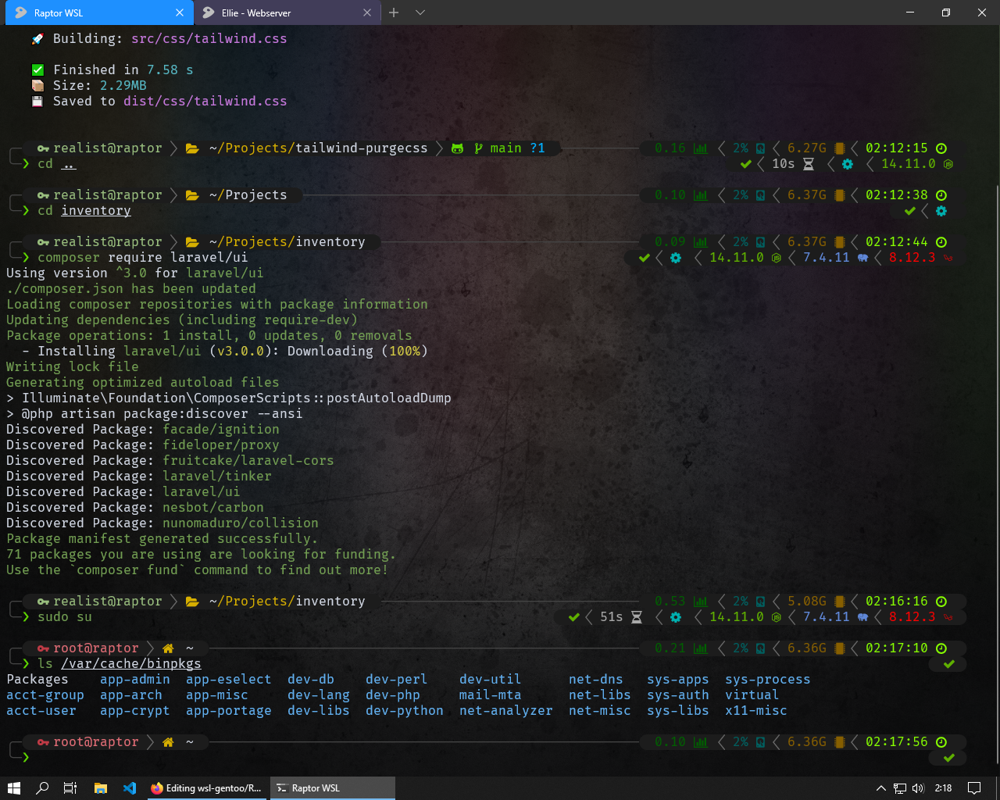

# Web develop Gentoo for WSL by Lotrando

Installation tutorial, how install Gentoo Linux for Webdevelopers with oh-my-zsh and Powerlevel10k theme on Windows.

... all [my configuration files](https://github.com/lotrando/wsl-gentoo/tree/main/configs) are downloadable.

With my configs your terminal might look like this 👇
<h1 align="center">
  
</h1>
